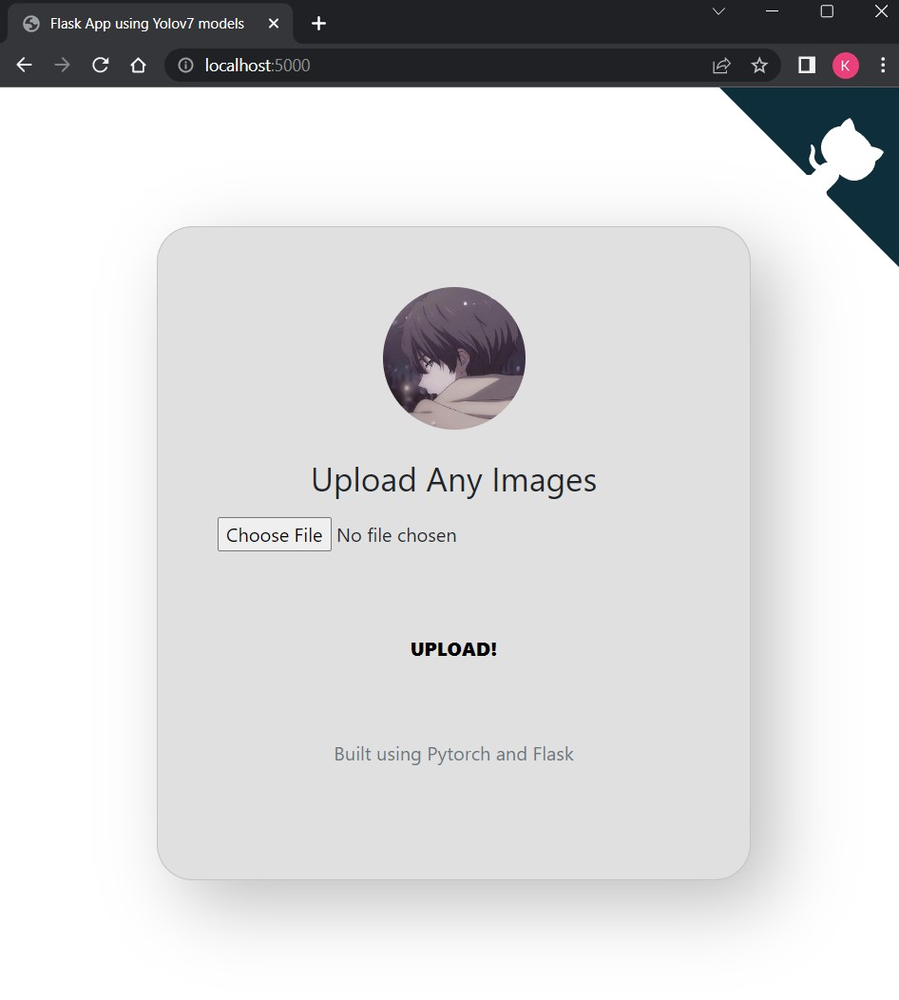
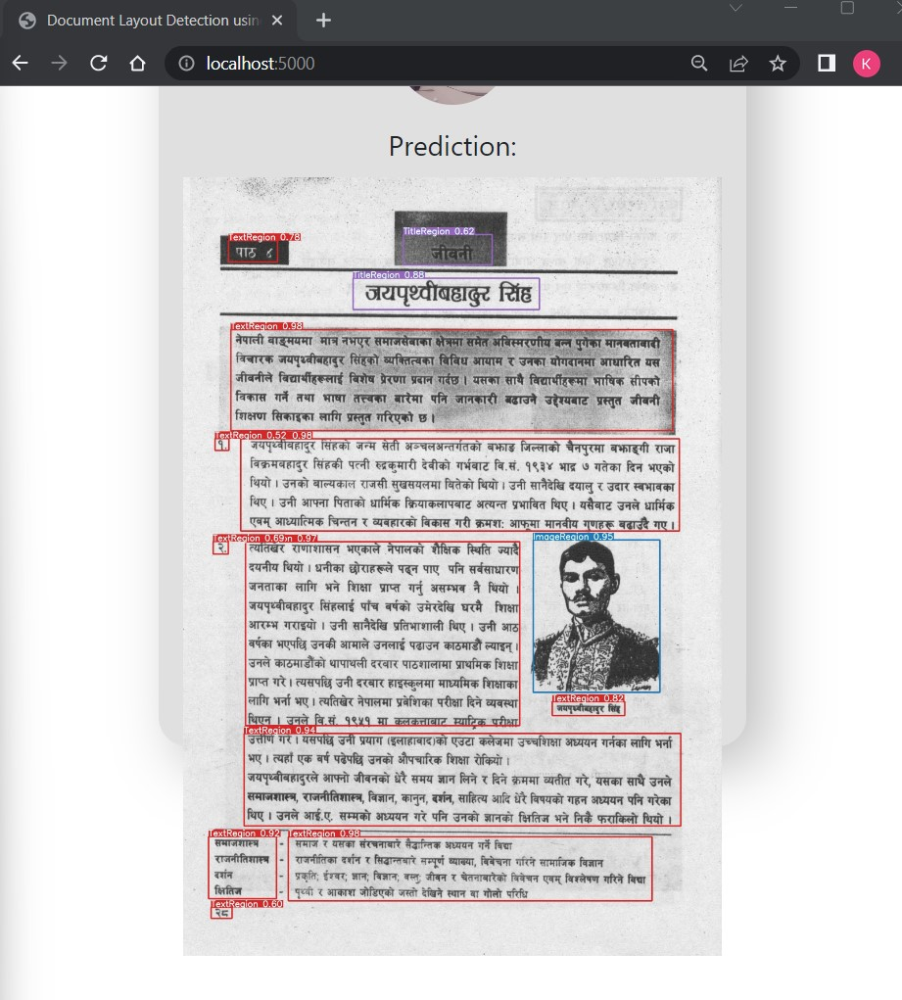
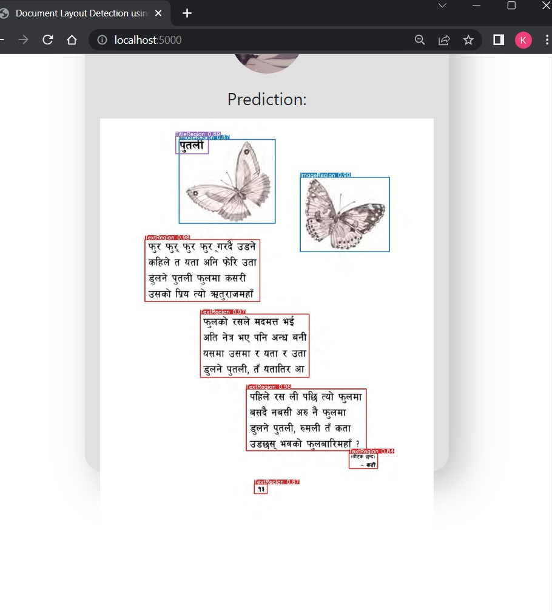

# Yolov7 document layout detection model deployment using flask
This repo contains example apps for exposing the [yolo7](https://github.com/WongKinYiu/yolov7) object detection modelvia a [flask](https://flask.palletsprojects.com/en/1.1.x/) app.

## Webapp:
Simple app consisting of a form where you can upload an image, and see the inference result of the model in the browser. 

Clone:
`$git clone https://github.com/keskhanal/document_layout_detection.git`

Run:
`$ python app.py`

then visit [http://localhost:5000/](http://localhost:5000/) in your browser:

## Homepage:
<p align="center">

</p>

## Results:
<p align="center">

</p>
<br>
<p align="center">

</p>

Processed images are saved in the `static` directory with a datetime for the filename.

The model inference results are:

```
{
  "result": [
    {
      "xmin": 101.1487808228,
      "ymin": 277.378112793,
      "xmax": 370.8252563477,
      "ymax": 418.8575744629,
      "confidence": 0.906429112,
      "class": 3,
      "name": "TextRegion"
    },
    {
      "xmin": 228.0145263672,
      "ymin": 448.4306640625,
      "xmax": 481.576751709,
      "ymax": 592.456237793,
      "confidence": 0.8831350207,
      "class": 3,
      "name": "TextRegion"
    },
    {
      "xmin": 335.0838012695,
      "ymin": 621.9591674805,
      "xmax": 618.7716674805,
      "ymax": 765.4934692383,
      "confidence": 0.8517528772,
      "class": 3,
      "name": "TextRegion"
    },
    {
      "xmin": 453.8703613281,
      "ymin": 129.5282745361,
      "xmax": 660.3602294922,
      "ymax": 303.9942321777,
      "confidence": 0.7677035332,
      "class": 0,
      "name": "ImageRegion"
    },
    {
      "xmin": 183.1075897217,
      "ymin": 47.565700531,
      "xmax": 401.8734130859,
      "ymax": 240.0441436768,
      "confidence": 0.6823134422,
      "class": 0,
      "name": "ImageRegion"
    },
    {
      "xmin": 569.0122070312,
      "ymin": 768.2710571289,
      "xmax": 637.3563842773,
      "ymax": 803.7015991211,
      "confidence": 0.674492836,
      "class": 3,
      "name": "TextRegion"
    },
    {
      "xmin": 172.0135498047,
      "ymin": 39.9447212219,
      "xmax": 249.85105896,
      "ymax": 80.5792694092,
      "confidence": 0.6716336608,
      "class": 4,
      "name": "TitleRegion"
    },
    {
      "xmin": 353.1632995605,
      "ymin": 839.2818603516,
      "xmax": 384.6405944824,
      "ymax": 862.0113525391,
      "confidence": 0.6276708841,
      "class": 3,
      "name": "TextRegion"
    }
  ]
}
```
a trained Yolov7 mode can be downloaded from [here](https://drive.google.com/file/d/1jGDnZm5tZVmrl0ChNulhyVcpoRgOSMQp/view?usp=sharing).

## Run & Develop locally
Run locally for dev, requirements mostly originate from [yolov7](https://github.com/WongKinYiu/yolov7/blob/main/requirements.txt):
* `python3 -m venv venv`
* `source venv/bin/activate`
* `(venv) $ pip install -r requirements.txt`
* `(venv) $ python app.py`


## Reference
- https://github.com/WongKinYiu/yolov7
- https://flask.palletsprojects.com/en/1.1.x

## Acknowledgment:
This framework was rewritten from this repo:
https://github.com/Michael-OvO/Yolov7-Flask/
